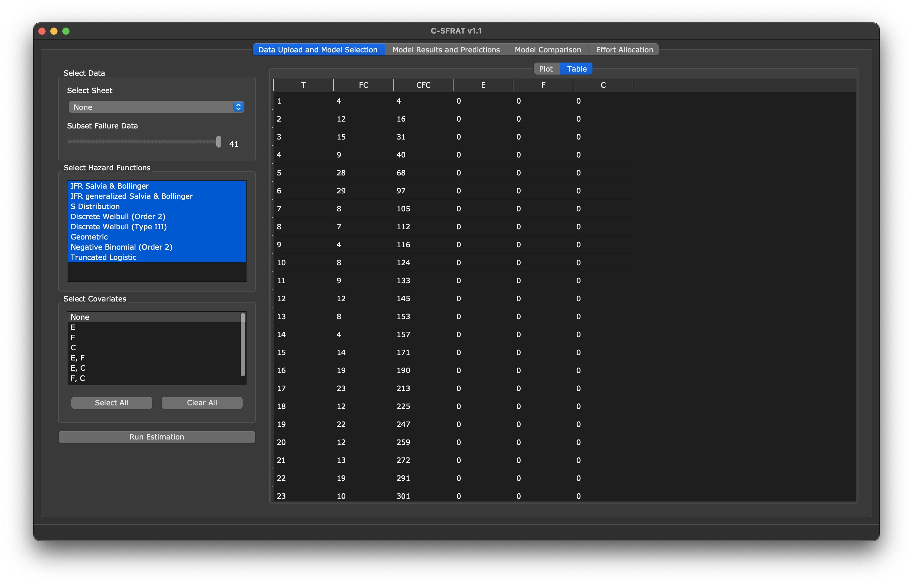
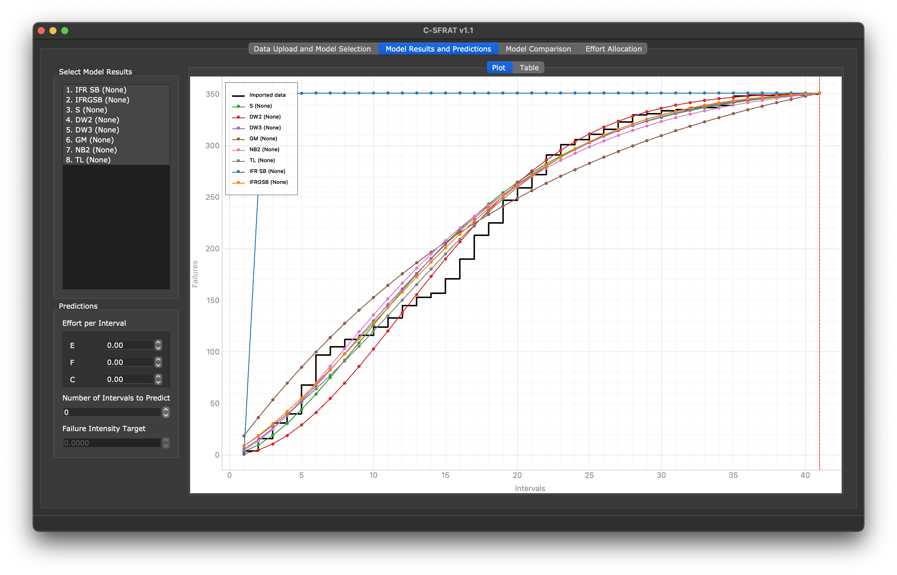
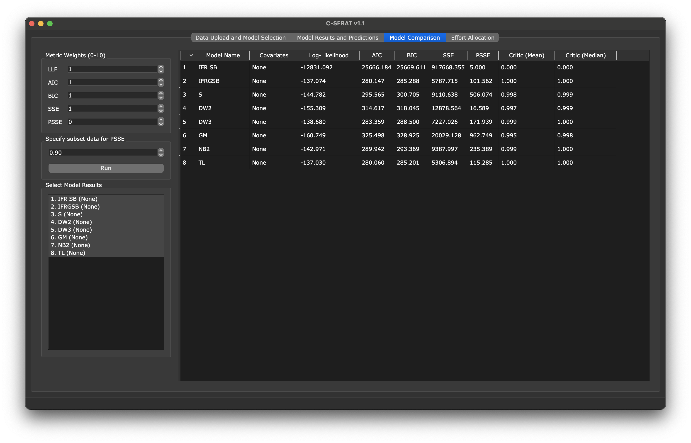
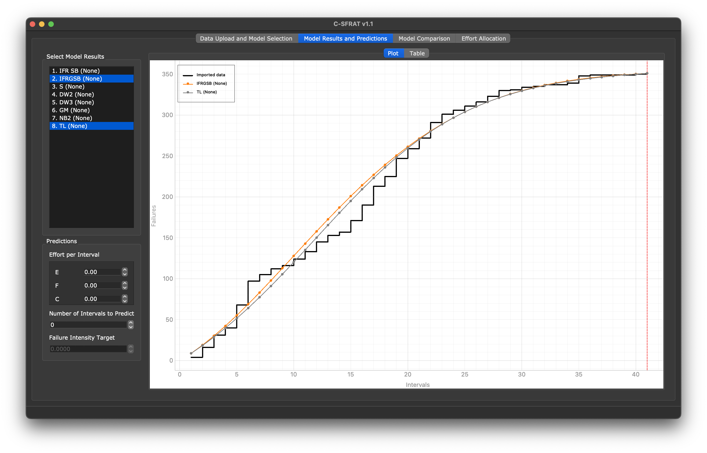
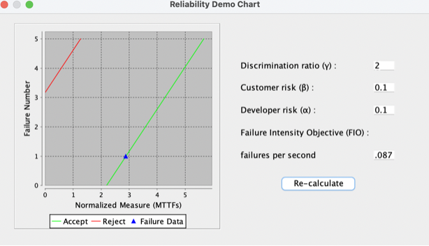
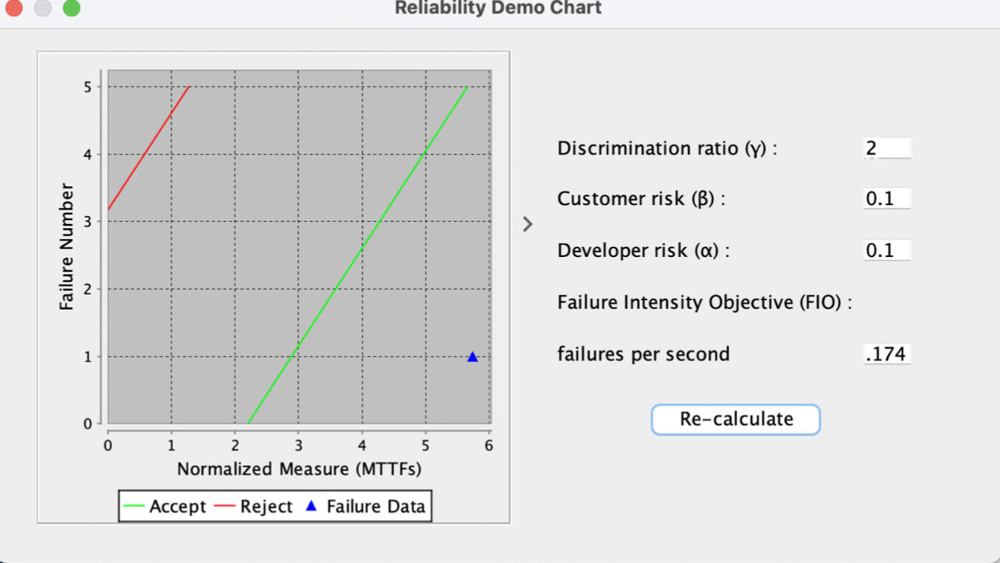
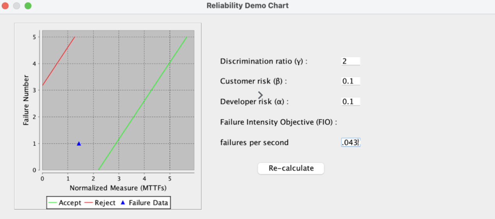

**SENG 438- Software Testing, Reliability, and Quality**

**Lab. Report \#5 – Software Reliability Assessment**

| Group \#:       |   |
|-----------------|---|
| Dominic Gartner  |   |
| Noel Thomas                |   |
| Alex Mclean                |   |
| Hamd Khan                |   |

# Introduction

# ADD ME HERE!! (DELETE ME)

# Assessment Using Reliability Growth Testing

For our assessment, we selected the CDS.DAT file. For compatibility with C-SFRAT, we converted it to a CSV, and included certain (inconsequential) fields. This is stored as DATA.csv at the root of this directory.

### Result of model comparison (top two models)
We selected the truncated logistic and IFR generalized Salvia and Bollinger models based on the log-likelihood. This tells how close the model generated curves are to the actual data points. Furthermore, the mean and median critic scores for each of these models were the highest of all tested models. We double checked with a qualitative analysis of the graphs.

### Result of range analysis
After careful examination of the fault graph and considering the quality and characteristics of the data presented, we have decided to utilize the entire range of data for our analysis. The data quality has been assessed as high, with no significant reasons to suspect inaccuracies or errors. Moreover, the dataset represents the system's performance during its operational phase, which is crucial for understanding its actual reliability in a real-world context. Given that there are no apparent outliers and anomalies, it is justifiable to include the full spectrum of data. This comprehensive approach ensures that we take into account all available information, thereby providing a holistic view of the system's reliability throughout its timeline.

## Plots for failure rate and reliability of the SUT

# ADD ME HERE!! (DELETE ME)

## Discussion on decision making given a target failure rate

# ADD ME HERE!! (DELETE ME)

## Advantages and disadvantages of reliability growth analysis
### Advantages
- **Tracking Bugs in Pre-release**: Reliability Growth Analysis allows for the tracking and identify of bugs or reliability issues during the pre-release phase of product development. By analyzing trends in failure data over time, we are able to detect and address potential issues early, leading to improved product quality and reduced post-release defects!
- **Guiding Software Testing Process**: Reliability Growth Analysis serves as a valuable tool for guiding the software testing process. By monitoring the trend of failure data and analyzing reliability metrics, we can pick and choose specific testing strategies and prioritize testing efforts based on identified reliability issues. This can speed up the testing process and allows for better testing coverage, which enhances the overall quality of the software!
- **Releasing the Product**: Reliability Growth Analysis aids in making informed decisions about releasing the product to the market. This helps mitigate the risk of releasing a potentially unreliable product, thereby safeguarding the organization's reputation and customer satisfaction!
### Disadvantages
- **Resource Intensive**: We noticed that Reliability Growth Analysis can be resource-intensive, which can require a significant amount of time and effort. Additionally, Reliability Growth Analysis requires a lot of data collection, analysis, and interpretation, which also can require a significant amount of time and effort.
- **Complexity of Data Analysis**: We also noticed that in reliability growth analysis there is a lot of complex data analysis and math involved. Additionally, the selecting of an appropriate model can also cause difficulties.

# Assessment Using Reliability Demonstration Chart 
Datachosen --> CRS3.Data

Smallest MTTFMin before not being acceptable = 0.087 

### MTTFmin Chosen = 0.087

### 2 X MTTFmin Chosen = 0.174

### 1/2 X MTTFmin Chosen = 0.0435

# Explain your evaluation and justification of how you decide the MTTFmin
# ADD ME HERE!! (DELETE ME)

# A discussion on the advantages and disadvantages of RDC
### Advantages of RDC:
- **Efficient Reliability Trend Analysis**: RDC provides an efficient method for analyzing reliability trends when failure data is limited to a few occurrences (unlike reliability growth analysis).
- **Decision Support**: RDC serves as a valuable decision support tool for assessing the reliability of a system. By setting target Mean Time To Failure (MTTF) and anticipated confidence levels, we can use RDC to determine whether the observed failure trend aligns with reliability objectives.
- **Visualization of Reliability Data**: RDC offers a visual representation of reliability data, making it easier to interpret and understand reliability trends. Graphical representations generated by RDC enable clear visualization of cumulative failure observations over time, facilitating trend analysis and communication of reliability insights.

### Disadvantages of RDC:
- **Limited Use if we Don't have lots of Data**: RDC may not be valuable in cases where failure data is sparse or unreliable. If the dataset is too small or lacks sufficient variability, RDC may not provide meaningful insights into reliability trends.
- **Manuel Setting of MTTF:** The effectiveness of RDC analysis is influenced by the setting of target MTTF. This could lead to varying interpretations of reliability requirements.
- **Complexity in Interpretation**: While RDC provides a visual representation of reliability trends, interpreting the results may require a certain level of expertise in reliability engineering and statistical analysis. Such that you have to understand RDC before even looking at a visual representation.

# Comparison of Results
### **Reliability Growth Testing (Using C-SFRAT):**

- The selected models for reliability growth testing were the truncated logistic and IFR generalized Salvia and Bollinger models.
- The log-likelihood method was used to select models based on the closeness of the model-generated curves to the actual data points.
- Qualitative analysis of the graphs supported the selection of the chosen models.
- The entire range of data was utilized for analysis, considering its high quality and representation of the system's performance during operational phases.

### **Reliability Demonstration Chart (RDC):**

- The data chosen for RDC analysis was CRS3.Data.
- The smallest MTTFMin before the system became unacceptable was found to be 0.087.
- MTTFmin chosen for analysis was 0.087.
- Further analysis was conducted by setting MTTF to twice and half the chosen MTTFmin, resulting in values of 0.174 and 0.0435 respectively.

# Discussion on Similarity and Differences of the Two Techniques
### Similarities:
- **Reliability Assessment**: Both techniques are used for reliability assessment of systems. They aim to provide insights into the reliability characteristics of a system, allowing for informed decisions regarding product development, release, and improvement!
- **Data Analysis**: Both techniques involve data analysis to understand the reliability performance of a system. Reliability Growth Analysis analyzes failure data collected during testing or operation to track reliability improvements over time. RDC analyzes failure data to determine reliability trends and assess whether reliability objectives are met.
- **Visualization**: Both techniques offer visual representations of reliability data to facilitate analysis and interpretation.

### Differences:
- **Data Collection**: Reliability Growth Analysis focuses on collecting failure data over multiple test cycles or operational phases to track reliability improvements. While, RDC is used when failure data is limited to a few occurrences, typically during testing, and aims to analyze the trend of reliability based on these limited observations.
- **The Objective of the Reliability Assessment**: The primary objective of Reliability Growth Analysis is to identify and quantify reliability improvements over time (development phase). While, RDC objective is to assess whether reliability objectives are met based on the observed failure trend (determine the current reliability status).

# How the team work/effort was divided and managed
As a team, we decided to split the work by sections. Two members worked on the first part of the lab on "Reliability Growth Testing" while the other two members worked on the second part on "Assessment using reliability demonstration chart". Once both parts were completed, all members reviewed the work of others, and gave feedback if needed. This divided the work load between team members, while achieving effective progress. 

# Difficulties encountered, challenges overcome, and lessons learned
Throughout this assignment, we did not face any major challenges as a group. But we had a lot of difficulties encountered with trying to download the C-SFRAT and running the data on it. As everyone in the group had mac's it was a lot harder to run and use the program! We tried may different virtual machines, which included: 
- University of Calgary's Windows 10 VMware Horizon Client (Didn't work as they don't have Java installed, and don't let you run .exe files without admin approval) 
- UTM Windows VM (We were not able to create an instance what wouldn't crash when trying to login to windows)
- University of Calgary's own computers (Didn't work as they don't have Java installed, and don't let you run .exe files without admin approval)

We ended up getting it working using Azure's VM, but this entire process was such a pain to over come. Maybe it might have been easier to use a different growth testing software... (If we did this lab again...)

# Comments/feedback on the lab itself
Other then the major challenge faced above, we really enjoyed this lab, it was helpful getting us familiar with the growth testing process, and using some concepts we learned in class in a real time environment. We found the lab document itself great and very easy to understand. Furthermore, the lab structure allowed for effective learning of testing methodologies and signified the importance of testing in a variety of methods.
